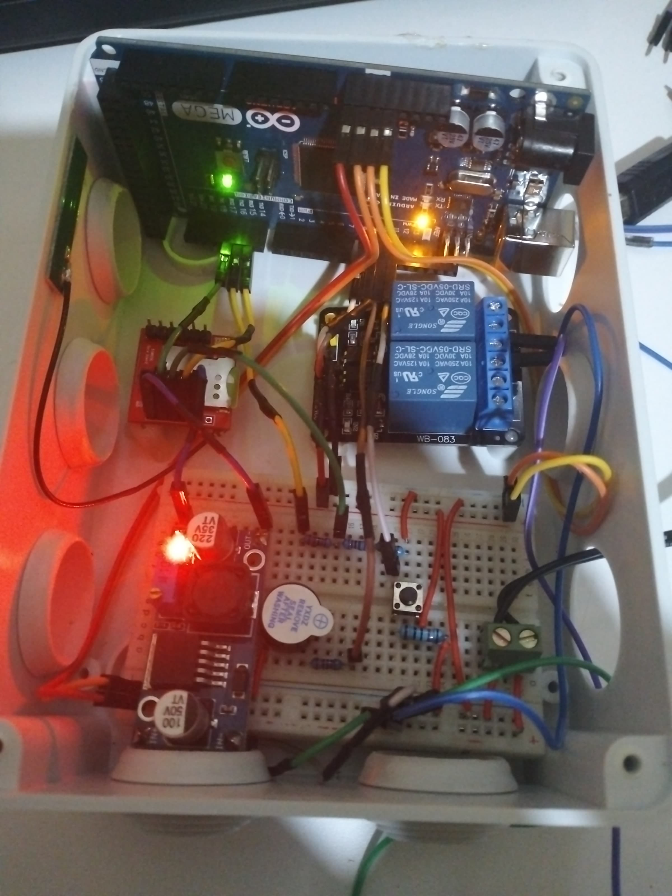

# Smart Home Irrigation system

## What is this?
it is a system to automate the watering of plants in your home
The system consists of a microcontroller (ESP32) that is connected to a water pump,
sensors to detect moisture levels in the soil, and a relay to turn the pump on and off.
The system can be controlled locally using push buttons, or remotely using a web interface

## How to use?
1. Open a web browser and visit [jamesmumo.com](https://jamesmumo.com)

### Powering on system
On system power on you see current water status

  
  

### Turning water on
After water is turned on you get notified for how long it has been running

  
  

### Turning water off
Water can be turned off manually or automatically by system

  
  

# Hardware Assembly Progress

### tools of work

### breadboard setup

### gsm simcard addition

### power supply

### let there be light

### Future improvements
* SMS notifications
* Watering schedule
* Automatic water level detection
